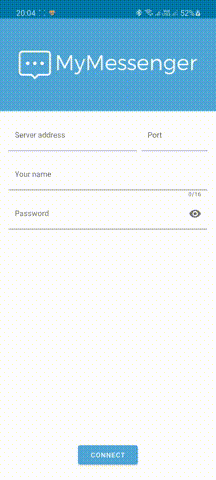

# myMessenger_client

## Описание
Улучшенная версия [клиента](https://github.com/antonmiron/Simple-Messenger-Client).
Приложение полностью переписано на kotlin, исправлено много недочетов, улучшен UX.

Сервер для клиента: https://github.com/antonmiron/myMessenger_server

## Список исправлений (улучшений)
- [x] Переписано на Kotlin, с использованием Single Activity architecture
- [x] Исправлена навигация в приложении (Android navigation component)
- [x] Добавлена возможность входа по паролю
- [x] Добавлены нотификации (+ возможность отвечать в нотификации)
- [x] Заметно улучшен UI (+ добавлены анимации)
- [x] Много мелких исправлений

## Требование
Создать клиент –серверное приложение для передачи текстовых сообщений.

2. Сервер – необходимо реализовать возможность подключения нескольких клиентов. (клиент подключается с заданным именем
   1. Сервер может быть написан как android приложение или как desktop приложение на языках (С#, Java или С++).
2. Android клиент должен:
   1. иметь возможность подключения к серверу по заданным адресу и порту и под заданным именем.
   1. Отображать сообщения в формате “имя_отправителя : текст_сообщения”.
